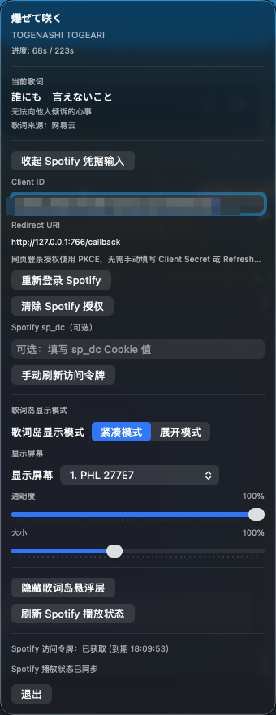

# LyricIslandMac

[English](README.md)

LyricIslandMac 是一个 macOS 菜单栏歌词应用，以类似 Dynamic Island 的悬浮窗形式展示同步歌词。应用外壳使用原生 `SwiftUI + AppKit`，歌词获取依赖本地 `.NET` helper 服务。

## 效果预览

### 紧凑模式


### 刘海屏模式


### 菜单与设置



## 功能特性

- 菜单栏应用，带刘海风格歌词悬浮窗
- 应用启动后默认显示歌词岛
- 支持紧凑模式和展开模式
- 支持固定显示到指定屏幕
- 鼠标悬停时自动变透明，且浮窗可点击穿透
- 通过 Spotify Web API 同步播放状态
- 支持基于 PKCE 的 Spotify 浏览器登录
- 通过 `Lyricify-Lyrics-Helper` 进行本地歌词解析与搜索
- 支持多来源歌词：Spotify、QQ 音乐、网易云

## 项目结构

```text
Sources/LyricIslandMac/
  App/        应用生命周期、菜单栏 UI、全局状态
  Overlay/    悬浮歌词岛窗口与渲染
  Playback/   Spotify 认证与播放状态客户端
  Lyrics/     本地 helper 桥接与歌词服务调用
  Settings/   设置窗口
  Shared/     共享模型

Tests/LyricIslandMacTests/
lyrics-service/LyricIsland.LyricsService/
lyrics-service/vendor/Lyricify.Lyrics.Helper/
```

## 环境要求

- macOS 14+
- 带 Swift 6 toolchain 的 Xcode，或较新的 SwiftPM 工具链
- 用于 `lyrics-service/LyricIsland.LyricsService` 的 .NET SDK
- 一个可用的 Spotify Developer App `Client ID`

## 构建与运行

构建 Swift 应用：

```bash
cd /Users/gibara/LyricIslandMac
swift build
```

通过 SwiftPM 运行应用：

```bash
swift run LyricIslandMac
```

构建本地歌词 helper：

```bash
cd /Users/gibara/LyricIslandMac/lyrics-service/LyricIsland.LyricsService
dotnet build
```

默认 helper 路径：

```text
/Users/gibara/LyricIslandMac/lyrics-service/LyricIsland.LyricsService/bin/Debug/net10.0/LyricIsland.LyricsService.dll
```

## 打包

生成可分发的 `.app`：

```bash
./scripts/build_app.sh
```

生成 `.dmg`：

```bash
./scripts/build_dmg.sh
```

产物会输出到 `dist/`。打包后的 app 会把本地歌词 helper 一并放进 `Contents/Resources/LyricsService/`，但目标机器仍然需要可用的 .NET runtime。

### GitHub Actions 自动发布

仓库已经包含 `.github/workflows/release-dmg.yml`。

- 推送形如 `v1.0.0` 的 tag 时，会自动构建 macOS `.dmg`
- Workflow 会把 DMG 上传到对应的 GitHub Release
- 也可以在 `Actions > Release DMG` 里手动触发
- Workflow 已升级到兼容 Node 24 的 action 版本

## Spotify 配置

1. 在 Spotify Developer Dashboard 中创建或打开你的应用。
2. 精确添加以下 Redirect URI：

```text
http://127.0.0.1:766/callback
```

3. 复制该应用的 `Client ID`。
4. 打开 LyricIslandMac 设置页并填入 `Client ID`。
5. 点击 `登录 Spotify`，在浏览器中完成授权。

应用会在本地保存返回的 refresh token，之后启动时会自动刷新 access token。

## 使用说明

- 应用启动后会自动显示歌词岛。
- 可在菜单中切换紧凑/展开模式，并选择显示到哪个屏幕。
- 浮窗是点击穿透的，不会阻挡后方窗口的交互。
- 如需用于 helper 侧的 Spotify 歌词/搜索，可额外填写 `sp_dc`。

## 当前实现范围

已实现：

- 真实 Spotify 播放状态轮询
- 基于 PKCE 的 Spotify 登录流程
- 菜单栏中的歌词岛显示控制
- 本地 `.NET` 歌词 helper 集成

仍未完善：

- 更复杂的歌词来源排序与合并逻辑
- 更完整的翻译/副歌词组合
- 更生产化的凭据存储方式，例如 Keychain

## 致谢

本项目本地 helper 中的歌词获取能力基于 [`Lyricify-Lyrics-Helper`](https://github.com/WXRIW/Lyricify-Lyrics-Helper)。该项目提供了核心的歌词解析、搜索与 provider 集成能力。
